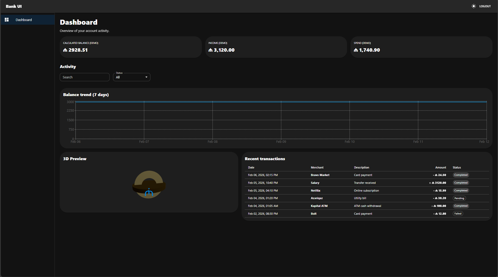
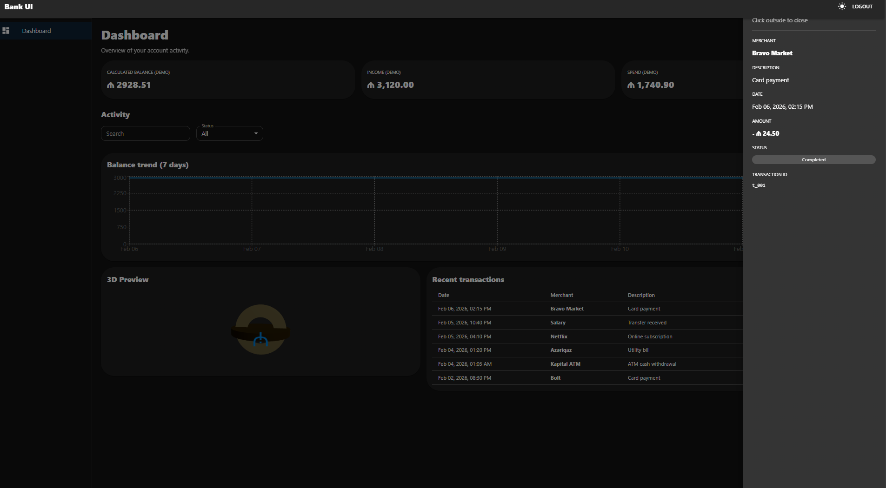

# Bank UI Dashboard (React + Vite + MUI)

Interview-ready banking dashboard built with **React 18**, **TypeScript**, **Vite** and **Material UI**.
Includes demo auth flow, protected routes, mock API, transactions table, filters, details drawer and a lightweight 3D card.

## Preview



## Features
- Demo authentication (token stored in `localStorage`)
- Protected routes (`/app/*`)
- Dashboard cards (balance/income/spend)
- Transactions table with:
  - Search + status filter
  - Click row → details drawer
- Balance trend chart (last 7 days)
- 3D preview card (React Three Fiber + Drei)
- Light/Dark theme toggle (persisted in `localStorage`)

## Tech Stack
- React 18 + TypeScript + Vite
- Material UI (MUI) + Emotion
- React Router
- Recharts
- Three.js via React Three Fiber + Drei

## Getting Started
```bash
npm install
npm run dev
